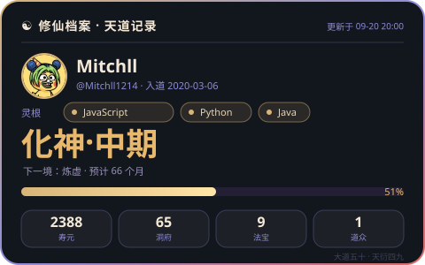
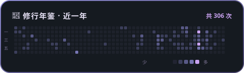
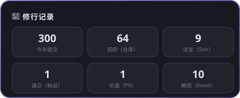
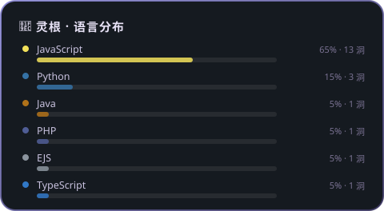
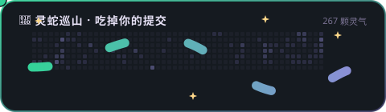
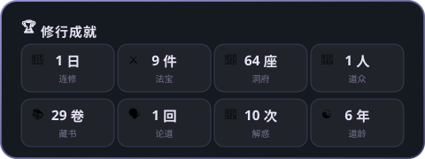

<!-- 1. 道号横幅（自建 SVG + SMIL 横向滚动字幕） -->

  

<!-- 2. 洞府主人 -->

  
  <h3>👋 你好，我是 Mitch</h3>
  
本洞府一切数据由 <b>GitHub Actions</b> 每日自动采集 · 零第三方服务

---

<!-- 3. 修仙档案 · 境界由注册时长自动定境（练气→飞升） -->

  <h4>☯️ 修仙境界 · 自动定境</h4>
  

 

<!-- 4. 虚拟灵宠 · 龙仔（由近期活跃度驱动成长与心情） -->

  <h4>🐲 虚拟灵宠 · 随活跃度成长</h4>
  

---

<!-- 5. 修行年鉴 · 近一年贡献热力图（自建） -->

  <h4>📅 修行年鉴</h4>
  

 

<!-- 6. 修行记录 + 灵根（自建统计卡） -->

  
    
  

---

<!-- 7. 天道灵脉 · 游龙修炼录（自建 SMIL 动画） -->

  

<!-- 8. 修行成就 -->

  

---

  
🧿 玩法说明 & 更新机制

  

    <b>☯ 修仙境界</b>（天道记录卡）：以注册 GitHub 的时长自动定境（练气 → 筑基 → 金丹 → 元婴 → 化神 → 炼虚 → 合体 → 大乘 → 渡劫 → 飞升），境界内分初期/中期/后期；寿元、洞府（仓库）、法宝（Star）、道众（粉丝）、灵根（常用语言）、灵力进度条均每日自动刷新。 
    <b>🐲 灵宠「龙仔」</b>：Q 萌小青龙，随活跃度成长 —— 近一年贡献推动它从 <b>龙蛋 → 幼龙 → 青龙 → 应龙 → 神龙</b>；近 30 日贡献为灵力条，最长连续提交为亲密度；今日有提交则"龙行云海"。 
    <b>📅 修行年鉴 / 📜 修行记录 / 🧬 灵根 / 🏆 修行成就</b>：近一年贡献热力图，以及年度提交、洞府、法宝、道众、论道（PR）、解惑（Issue）等指标一览；灵根即你最常用的编程语言。 
    <b>🐉 天道灵脉 · 游龙修炼录</b>：一条灵脉流光与游龙珠昼夜巡游（纯动画装饰卡，提交 = 修炼经验）。
  

  

    <b>更新机制</b>：<code>.github/workflows/update-profile.yml</code> 定时（每天 08:17 北京时间）或手动触发，用 <code>GITHUB_TOKEN</code> 调 GitHub 官方 GraphQL API 实时采集数据，按 <code>api/</code>（修仙档案/灵宠）、<code>scripts/</code>（横幅/年鉴/记录/灵根/成就/游龙录）中的代码重新渲染全部卡片并提交回仓库 —— 全程只依赖 GitHub 自身，不调用任何第三方平台。 
    修改卡片样式：编辑 <code>api/</code> 或 <code>scripts/</code> 下的代码（<code>local/</code> 与 workflow 文件本身也在 push 触发范围内）后 push，workflow 会自动拉取最新数据、用新代码重新生成全部卡片；也可在仓库 Actions 页手动点击 <b>Run workflow</b> 立即刷新。 
    ⚠ <code>images/</code> 下的 SVG 均为自动生成产物：手动编辑会被下次生成覆盖；且仅改动 <code>README.md</code> 或 <code>images/</code> 不会触发自动更新。 
    本地预览：<code>node local/generate.js --mock</code>（合成数据）→ 查看 <code>images/</code> 下的 SVG；或 <code>node local/server.js</code> → <code>http://localhost:8787/preview</code>。
  

